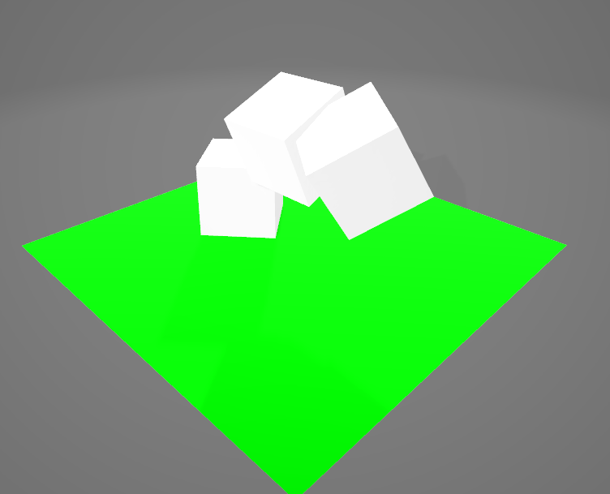

# gltf-exporter
An expanded version of the example gltf export function from (gltf_json)[https://github.com/gltf-rs/gltf] crate.

Specifically it is based upon the example (here)[https://github.com/gltf-rs/gltf/blob/master/examples/export/main.rs]

The application uses a DSL to create GLTF objects and allows for UV mapping. This is deliberately not feature rich, if you need more features in the exported GLTF then it is probably best to clone this repo and add those. This exporter is created with the specific purpose of allowing code generated files to be created which can then be turned  into a GLTF, it will eventually tie in to a series on Bevy that is being prepared for YouTube. 

## Usage
The file must contain the the outline for your triangles, in groups of 3. The layout is as follows

x, y, z, r, g, b, uv.x, uv.y

x,y,z - The coordinates of the point
r, g, b - The color R G B values at that point
uv.x, uv.y - The texture mapping coordinates for your face

See `plane.txt` for an example of a flat surface, remember that triangles only render on their front face.

## Running the app
eg.
`cargo run -- examples/plane.txt`

This will output the GLTF file into the output folder, it will have the same name as the input file.

## Composite files
You can link to another file (relative to the file the line is in) by using the following syntax

`>filename, x_offset, y_offset, z_offset, rot_x, rot_y, rot_z`
or
`>filename, x_offset, y_offset, z_offset, rot_y`

## Example composite
This example combines a flat plane (front and back) and then stacks and rotates some cubes. It can
be compiled using `cargo run -- examples/composite.txt`. 

The code is:

```
#GroundPlane
2.5,-1.5,-2.5,0.0,1.0,0.0,1.0,1.0
-2.5,-1.5,-2.5,0.0,1.0,0.0,0.0,1.0
2.5,-1.5,2.5,0.0,1.0,0.0,1.0,0.0
-2.5,-1.5,-2.5,0.0,1.0,0.0,0.0,1.0
-2.5,-1.5,2.5,0.0,1.0,0.0,0.0,0.0
2.5,-1.5,2.5,0.0,1.0,0.0,1.0,0.0
#Grounplane-reflect
-2.5,-1.5,-2.5,0.0,1.0,0.0,0.0,1.0
2.5,-1.5,-2.5,0.0,1.0,0.0,1.0,1.0
2.5,-1.5,2.5,0.0,1.0,0.0,1.0,0.0
-2.5,-1.5,2.5,0.0,1.0,0.0,0.0,0.0
-2.5,-1.5,-2.5,0.0,1.0,0.0,0.0,1.0
2.5,-1.5,2.5,0.0,1.0,0.0,1.0,0.0
#HouseBase - x,y,z,rot
>./cube.txt,-1.0,-0.99,0.0,0.7
>./cube.txt,0.0,0.0,0.0,0.4,0.0,0.0
>./cube.txt,1.0,0.0,0.0,0.7,0.7,0.7
```

And this will give a similar output to this:

